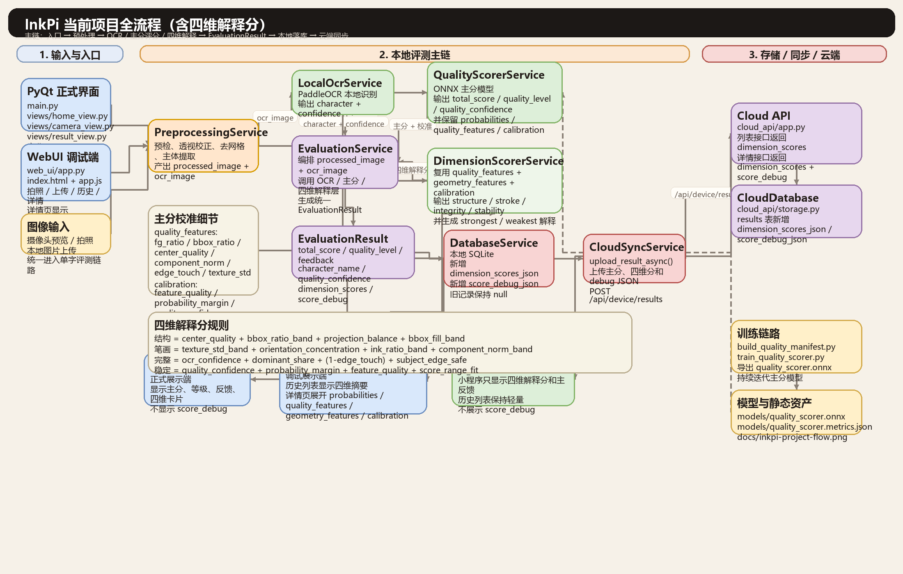

# InkPi

InkPi 是一套面向树莓派 / 桌面演示场景的书法自动评测项目。当前工作区采用单链路方案：

`图像预处理 -> OCR 识别 -> ONNX 质量评分 -> 本地存储 -> 云端同步 -> 小程序查看`

如果你要先看全局，建议先打开：

- [项目总流程图（draw.io）](docs/inkpi-project-flow.drawio)
- [训练说明](training/README.md)

## 项目总流程图

源文件：

- [draw.io 可编辑源文件](docs/inkpi-project-flow.drawio)

预览图：



## 当前主流程

1. 桌面端 `main.py` 或本地 WebUI `web_ui/app.py` 接收摄像头画面或上传图片。
2. `services/preprocessing_service.py` 做图像预检、透视校正、网格去除、二值化、主体提取，并额外生成 OCR 用图。
3. `services/evaluation_service.py` 调用 `services/local_ocr_service.py` 和 `services/quality_scorer_service.py`，组合出 `models/evaluation_result.py`。
4. `services/database_service.py` 将结果写入本地 SQLite，并由 `services/cloud_sync_service.py` 异步上传到云端。
5. `cloud_api/app.py` 提供登录、历史、摘要、设备上传和远程 OCR 接口；`miniapp/` 从云端读取历史结果。

## 评分细节

当前评分不是单纯“跑一下模型拿个分”，而是由 OCR 结果、图像特征和 ONNX 输出一起组成：

1. `PreprocessingService` 会产出两份图像：
   `processed_image` 给评分模型使用，`ocr_image` 给 OCR 使用。
2. `LocalOcrService` 先识别当前单字，得到：
   `character_name` 和 `ocr_confidence`。
3. `QualityScorerService` 会把评分输入整理成：
   `32x32` 灰度归一化 ROI、首字符编码 `char_code`、`ocr_confidence`。
4. 除了图像本身，评分器还会抽取 6 个质量特征：
   `fg_ratio`、`bbox_ratio`、`center_quality`、`component_norm`、`edge_touch`、`texture_std`。
5. ONNX 模型先输出 `bad / medium / good` 三档概率：
   最大概率对应 `quality_level`，最大概率值对应 `quality_confidence`。
6. `total_score` 的生成分两种情况：
   如果模型没有直接给 `raw_score`，就用“概率 + 特征 + OCR 置信度”做校准。
   如果 `raw_score <= 1`，则按 `35% raw_score + 65% calibrated_score` 融合。
7. 当前校准区间是：
   `bad: 44-68`，`medium: 66-84`，`good: 82-98`。
8. `EvaluationService` 最终还会生成反馈文案：
   按 `quality_level` 选模板，再结合 `total_score` 选择反馈变体；如果识别到了字，还会把“识别字 + 评测等级”拼进结果。

最终统一输出字段包括：

- `character_name`
- `ocr_confidence`
- `total_score`
- `quality_level`
- `quality_confidence`
- `feedback`
- `image_path`
- `processed_image_path`

## 系统入口

- 桌面端：`python main.py`
- 本地 WebUI：`python -m web_ui.app`
- 云端 API：`python cloud_api/app.py`
- 微信小程序：`miniapp/`

默认地址：

- WebUI: `http://127.0.0.1:5000`
- Cloud API: `http://127.0.0.1:5001`

## 目录说明

- [`config/`](config): 运行配置、路径、设备与云端参数
- [`views/`](views): PyQt 桌面端界面，含首页、拍照、结果、历史
- [`services/`](services): 运行时核心服务，包含预处理、OCR、评分、本地存储、云同步
- [`models/`](models): 运行时数据模型和 ONNX 模型产物
- [`web_ui/`](web_ui): 本地浏览器端 UI 与 Flask API
- [`cloud_api/`](cloud_api): 云端历史与登录 API
- [`miniapp/`](miniapp): 微信小程序登录 / 历史 / 结果页面
- [`training/`](training): 质量评分模型训练脚本
- [`docs/`](docs): 项目说明与可编辑流程图

## 快速启动

先安装依赖：

```bash
pip install -r requirements.txt
```

启动桌面端：

```bash
python main.py
```

启动 WebUI：

```bash
python -m web_ui.app
```

启动云端 API：

```bash
python cloud_api/app.py
```

如果要启用本地结果自动同步到云端，准备 `.inkpi/cloud.env`：

```env
INKPI_CLOUD_BACKEND_URL=http://127.0.0.1:5001
INKPI_CLOUD_DEVICE_KEY=your-device-key
INKPI_CLOUD_DEVICE_NAME=InkPi-Raspberry-Pi
```

说明：

- `CloudSyncService` 会在本地保存结果后异步上传到 `/api/device/results`
- `LocalOcrService` 在本地 PaddleOCR 不可用时，可以回退到云端 `/api/device/ocr`

## 测试

常用回归测试：

```bash
python -m unittest test_web_ui.py
python -m unittest test_all.py
python -m unittest test_cloud_api.py
python -m unittest test_cloud_ocr_api.py
python -m unittest test_cloud_sync_integration.py
```

## CI 说明

GitHub Actions 里的 Python CI 建议只跑跨平台逻辑，不直接覆盖树莓派专属执行路径。原因很简单：

- GitHub 托管 runner 没有树莓派摄像头、GPIO、SPI、libcamera 环境
- 这类能力更适合留给真机联调、部署脚本或单独的树莓派自托管 runner
- 当前仓库的核心单元测试已经可以在普通 Linux / Windows 环境下覆盖主要业务逻辑

## 训练链路

当前训练主线只保留单图质量评分模型，不再以模板库或 Siamese 双图对比作为运行时主链路。

- [`training/build_quality_manifest.py`](training/build_quality_manifest.py)：构建三档质量清单
- [`training/train_quality_scorer.py`](training/train_quality_scorer.py)：训练 ONNX 质量评分模型
- [`training/train_quality_scorer.sh`](training/train_quality_scorer.sh)：一键完成清单构建、训练与导出
- [`models/quality_scorer.onnx`](models/quality_scorer.onnx)：运行时使用的质量评分模型
- [`models/quality_scorer.metrics.json`](models/quality_scorer.metrics.json)：当前模型指标摘要

## 云端与小程序

- 云端服务入口：[`cloud_api/app.py`](cloud_api/app.py)
- 云端存储实现：[`cloud_api/storage.py`](cloud_api/storage.py)
- 小程序接口封装：[`miniapp/utils/api.js`](miniapp/utils/api.js)
- 小程序当前后端地址配置：[`miniapp/config.js`](miniapp/config.js)

小程序当前页面结构：

- 登录页：`pages/login`
- 历史列表页：`pages/history`
- 单条结果页：`pages/result`

## 文档

- [项目总流程图（draw.io）](docs/inkpi-project-flow.drawio)
- [文档索引](docs/README.md)
- [训练说明](training/README.md)

## 四维解释分

当前代码已经落地单字四维解释分，固定维度为：

- `structure` / 结构
- `stroke` / 笔画
- `integrity` / 完整
- `stability` / 稳定

实现方式：

- `total_score` 继续保留为主分，不由四维分反推
- `services/quality_scorer_service.py` 继续负责主分、等级、概率和校准中间量
- `services/dimension_scorer_service.py` 复用质量特征、几何特征和校准信号，生成四维解释分
- `models/evaluation_result.py` 新增 `dimension_scores` 和 `score_debug`

各端展示约定：

- Qt 结果页显示主分、等级、反馈和四维解释分
- 本地 WebUI 作为 debug 端，详情页额外显示 `score_debug`
- 云端历史列表返回 `dimension_scores`，不返回 `score_debug`
- 云端详情和本地 WebUI 详情返回 `score_debug`
- 小程序只在结果详情页展示四维解释分，不展示 debug 原始数据
